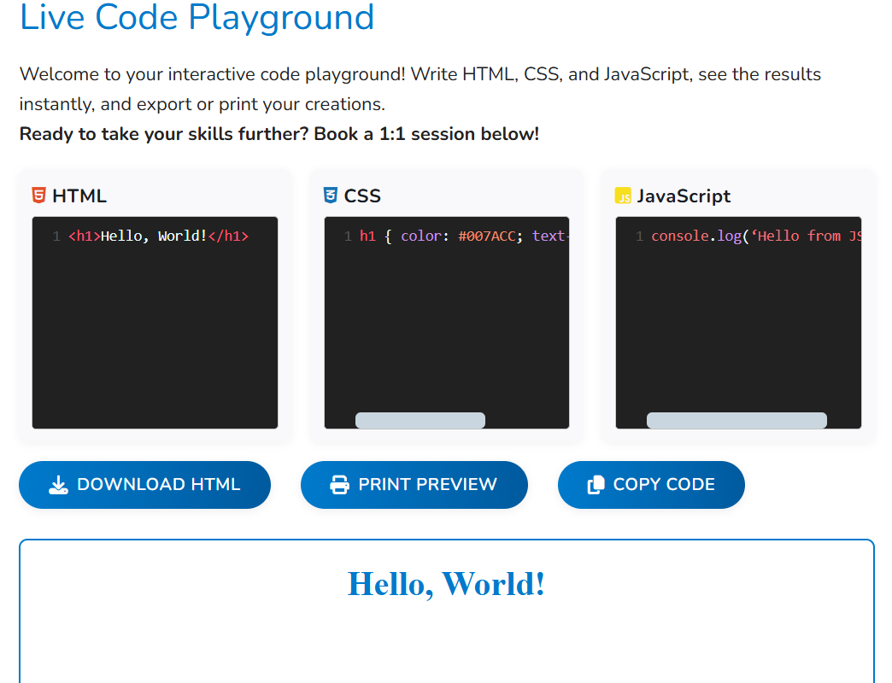

# Live Code Playground 🎨💻

[](https://sawdatascience.com/live-code-playground-write-preview-and-export-your-code/)
[](https://codemirror.net/)
[](LICENSE)

An interactive, browser-based code editor that lets users write, preview, and export HTML, CSS, and JavaScript in real-time.

---

## 🌟 Features

- Real-time preview
- Triple editor layout
- Syntax highlighting (CodeMirror)
- Export/download HTML files
- Print preview
- Copy code to clipboard
- Responsive and sandboxed

---

## 🚀 Impact & Metrics

- 1,000+ Active Learners
- Used by bootcamps, schools, and coding educators
- Runs entirely in the browser (zero setup)

---

## 💻 Tech Stack

- Frontend: HTML5, CSS3, Vanilla JS
- Editor: CodeMirror 5.65
- Icons: Font Awesome 6.5

---

## 📋 Core Implementation

```javascript
function updatePreview() {
    const html = htmlEditor.getValue();
    const css = cssEditor.getValue();
    const js = jsEditor.getValue();

    const src = `
    <html>
        <head>
            <style>${css}</style>
        </head>
        <body>
            ${html}
            <script>${js}<\/script>
        </body>
    </html>
    `;
    const iframe = document.getElementById('preview-pane');
    iframe.srcdoc = src;
}

function downloadHTML() {
    const html = htmlEditor.getValue();
    const css = cssEditor.getValue();
    const js = jsEditor.getValue();

    const src = `
    <!DOCTYPE html>
    <html>
    <head>
        <style>${css}</style>
    </head>
    <body>
        ${html}
        <script>${js}<\/script>
    </body>
    </html>`;
    const blob = new Blob([src], {type: 'text/html'});
    const a = document.createElement('a');
    a.href = URL.createObjectURL(blob);
    a.download = 'code-playground.html';
    a.click();
}
```

#### Sample Code Explained

- `updatePreview()`: Instantly updates the live preview area with the current HTML, CSS, and JavaScript so users can see their code run in real time.
- `downloadHTML()`: Lets users export everything they wrote as a single HTML file, with all CSS and JS inlined, for easy offline use or sharing.

---

## 🔧 Usage

1. Visit [Live Demo](https://sawdatascience.com/live-code-playground-write-preview-and-export-your-code/)
2. Start coding instantly
3. Export, print, or copy your code

---

## 🎨 User Interface

- Modern, flexible layout
- Color-coded panels and clear labels
- Instant feedback

---

## 🖼️ Screenshots & Demo




---

## 📝 License

Proprietary—contact for details.

---

## 👨‍⚕️ Author

**Dr. David Gramling, PhD**  
Director of Data Science & AI | Coding Education Advocate

---

## 📞 Contact

- Website: [sawdatascience.com](https://sawdatascience.com)
- GitHub: [@Dgsc23](https://github.com/Dgsc23)
- [Schedule Consultation](https://sawdatascience.com/get-started-on-your-data-driven-journey-book-an-appointment-with-dr-david-gramling-ph-d/)

---

*Note: Used by 1,000+ learners and instructors. Full source available under NDA for educational partners.*
